# Autonomous Bot

## Current Quadruped Model -

Click [here](https://minhaskamal.github.io/DownGit/#/home?url=https://github.com/RoboManipal-9-0/Competitions/tree/ABU-Robocon-2019/RoboCon2019/FILES/Quadruped) to download the STEP File for Quadruped.

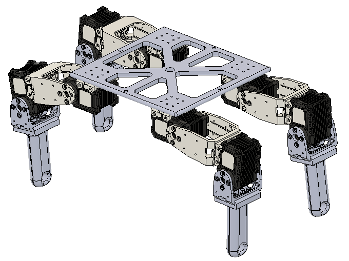 

## Model Divided into Three Parts -
 - Body: Frame + Four Motors at the Hips.
 - Link 1: Link Joining the Two Motors + Knee Motor.
 - Link 2: Link After the Knee Motor.

## Body -

Click [here](https://a360.co/2PoCGyn) to view STL File.

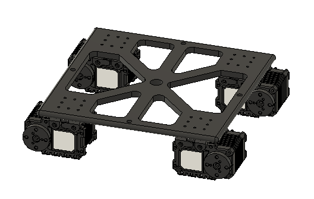   
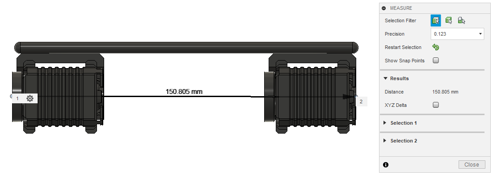   
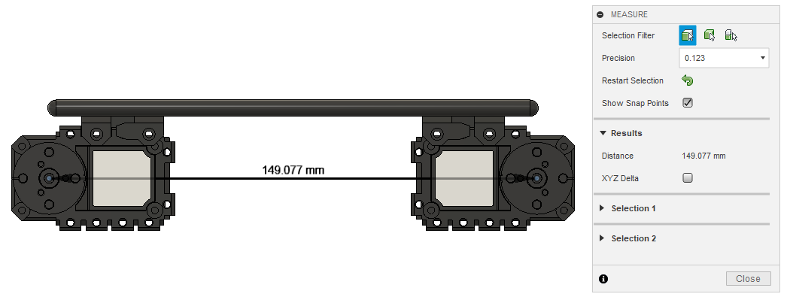  

## Link_1 -

Click [here](https://a360.co/2PmL2H5) to view STL File.

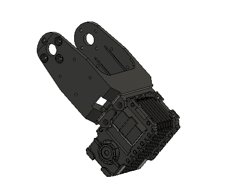   
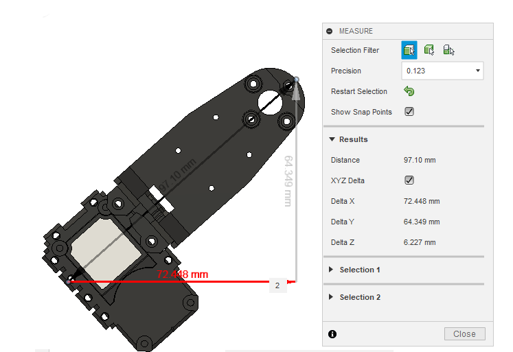   
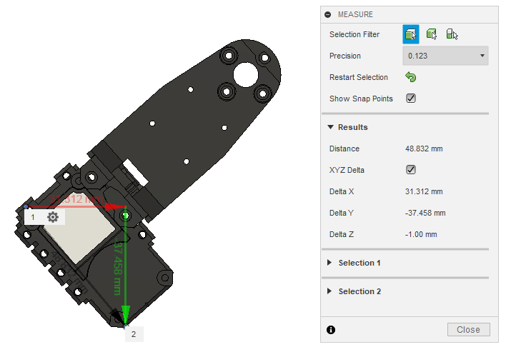   
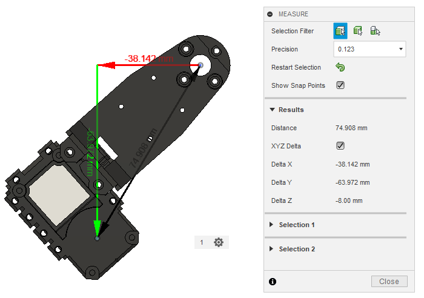   
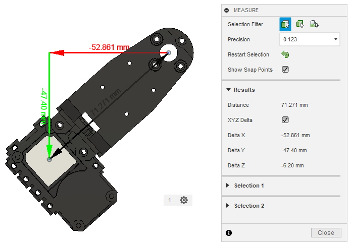   

## Link_2 -

Click [here](https://a360.co/2FqRFTQ) to view STL File.

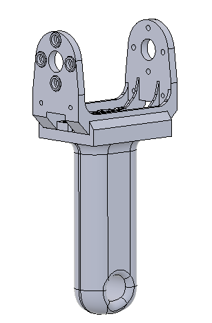   
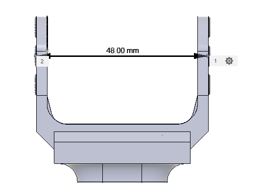   
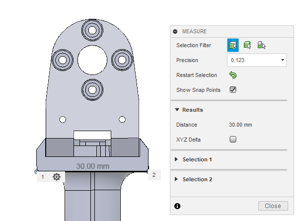   
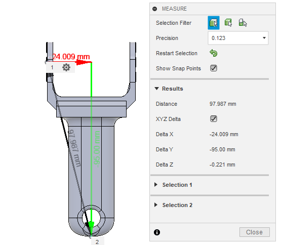   
