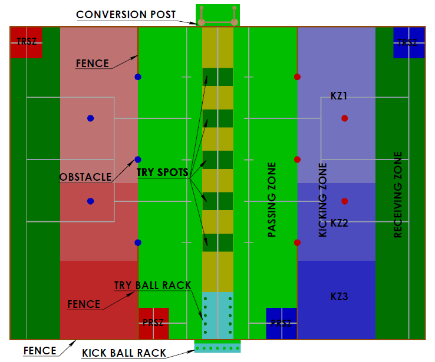
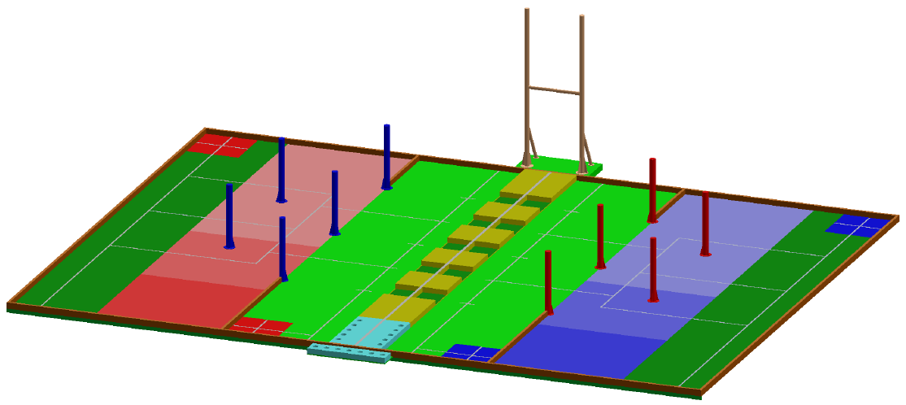
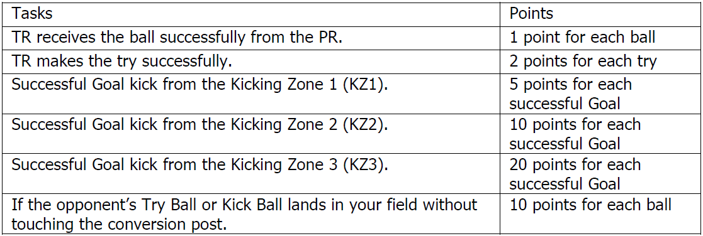

# Competition
ABU RoboCon 2019 (Main website [here](https://www.aburobocon2020.com.fj/))

**Arena (Top view)** 

**Arena (Ortho)** 

**Points table** 

## Bot Specifications

| Bot | Width | Length | Height |
| :---: | :---: | :---: | :---: |
| _TR_ |  1000 mm  | 1000 mm  | 1500 mm  |
| _TR_ (in-game max) |  1200 mm  | 1200 mm  | 1500 mm  |
| _PR_ | 1000 mm  | 1000 mm  | 1200 mm |
| _PR_ (in-game max) | 1200 mm  | 1200 mm  | 1200 mm |
(TR stands for Try Robot, PR stands for Pass Robot)

Maximum weight of both the bots combined is 50 Kg.

## Useful links
### Rulebook
- [Official - With September 30th Changes](https://www.aburobocon2020.com.fj/wp-content/uploads/2019/10/ABU_Robocon_2020_Rulebook_Sep_30.pdf)

### Others
- [FAQ](https://www.aburobocon2020.com.fj/faq)
